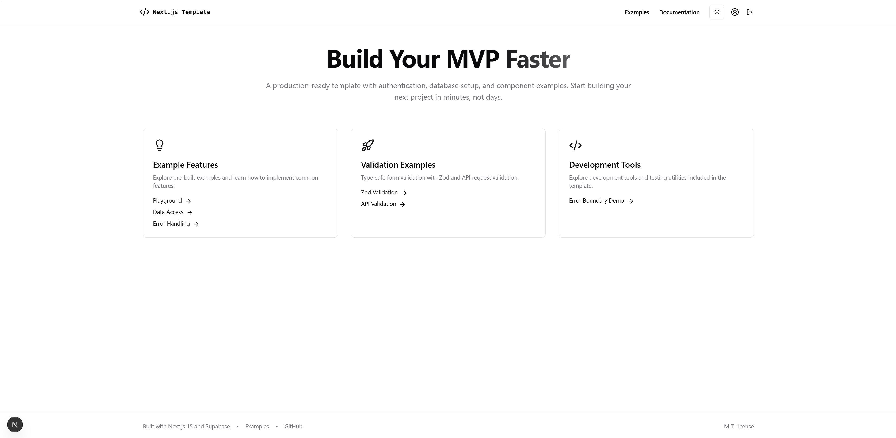

# Next.js 15 Template Application

[](https://opensource.org/licenses/MIT)
[](https://nextjs.org/)
[](https://reactjs.org/)
[](https://supabase.io/)
[](https://www.typescriptlang.org/)

A production-ready template for building modern web applications with Next.js 15, Supabase, and shadcn/ui. Designed for rapid MVP development with built-in authentication, database setup, and component examples.
<!-- ➡️ [View Demo](https://your-demo-url.com) --> <!-- Add your demo URL if available -->




## 🚀 Why Use This Template?

 - **Rapid MVP Development:** Quickly set up authentication, database, UI components, and form handling.

 - **Supabase Integration:** Pre-configured database setup with migrations and schema management.

 - **Comprehensive Testing**: Built-in Storybook, Vitest, and Playwright configurations.

 - **Responsive UI**: Mobile-first design approach with shadcn/ui components.

 - **CI/CD Ready:** Includes GitHub Actions workflows for automated testing and deployment.

## 📋 Prerequisites

- Node.js (18.17+)

- pnpm (9.5.0)

- Git

- Docker (required for Supabase)
## ⚡ Quick Start

1. Clone the repository (alternatively you can navigate to https://github.com/CCCeddy/next-supabase-template and select 'Use this template'):
   ```bash
   git clone https://github.com/CCCeddy/next-supabase-template.git my-project
   ```

2. Navigate to project directory:
   ```bash
   cd my-project
   ```

3. Install dependencies:
   ```bash
   pnpm install
   ```

4. Set up environment variables:
   ```bash
   cp .env.example .env.local
   ```

5. Start development server:
   ```bash
   pnpm dev
   ```

6. Visit [http://localhost:3000](http://localhost:3000) to see your application!

## 🏁 Getting Started

After running the application, you'll see the home page with navigation to explore the template features. Here's what to check out first:

- **Home Page**: Overview of the template with key features
- **Playground**: Interactive demo of the UI components
- **Various other example pages**: Zod  validation, API validation, and more
- **Login/Signup**: Authentication flow examples - **Note: you will need to set up Supabase for this**

If you want to test features that require authentication, follow the Supabase setup instructions in the next section.


## 🔐 Setting Up Supabase for Authentication

Supabase powers the authentication and database functionality in this template. Follow these steps to set it up properly:

### Prerequisites for Supabase

1. Install and set up Supabase CLI and Docker
   - Follow the official guide: [Supabase Local Development](https://supabase.com/docs/guides/local-development/cli/getting-started?queryGroups=platform&platform=windows&queryGroups=access-method&access-method=analytics)
   - **Important**: Do not run `supabase init` and ensure Docker is configured to "Expose daemon on tcp://localhost:2375 without TLS"
   - If you have already run `supabase init`, remove the `config.toml` in the `supabase` directory before setting up Supabase for this project.

2. If you've previously used Supabase CLI, stop any running instances:
   ```bash
   supabase stop
   ```

### Setting Up Supabase for This Project

1. Configure auth providers in your `.env.local` file:
   ```bash
   # Add these values to your .env.local
   GOOGLE_CLIENT_ID=your_google_client_id
   GOOGLE_CLIENT_SECRET=your_google_client_secret
   GITHUB_ID=your_github_id
   GITHUB_SECRET=your_github_secret
   ```

   **How to get these credentials:**
   - For Google: Create a project in [Google Cloud Console](https://console.cloud.google.com/)
     - Set authorized JavaScript origin to `http://localhost:3000`
     - Set redirect URI to `http://localhost:54321/auth/v1/callback`
   
   - For GitHub: Create an OAuth app in [GitHub Developer Settings](https://github.com/settings/developers)
     - Set homepage URL to `http://localhost:3000`
     - Set authorization callback URL to `http://localhost:54321/auth/v1/callback`

2. Initialize and start Supabase with custom settings:
   ```bash
   pnpm setup-supabase my-project 0
   ```
   
   This command:
   - Creates a Supabase project named "my-project"
   - Uses the default port (54321) for the callback URL
   - To use a different port, specify a port increment (e.g., `10` would use port 54331)
   
   The `setup-supabase` script handles:
   - Creating necessary configuration files
   - Initializing the Supabase project
   - Starting the Supabase services
   - Setting up authentication providers
   - Applying database migrations

3. After Supabase starts successfully, you can:
   - Test authentication flows
   - Access the data-access-demo page
   - View and edit your profile

4. Access Supabase Studio locally at [http://localhost:54323](http://localhost:54323)

## 💫 Other Features

### Database Management

Apply database migrations:
```bash
supabase db reset
```

Generate TypeScript types from your database schema:
```bash
supabase gen types typescript --local > src/types/supabase.ts
```

## 🧪 Testing Suite

```bash
# Component Testing (Storybook)
pnpm storybook          # Runs on port 6006
pnpm build-storybook    # Builds static Storybook
pnpm chromatic          # Deploys to Chromatic

# Unit Tests (Vitest)
pnpm test              # Run tests in watch mode
pnpm test:run          # Run tests once
pnpm test:coverage     # Run tests with coverage

# E2E Tests (Playwright)
pnpm test:playwright   # Run E2E tests
```

## 📱 Responsive Design

This template implements a mobile-first approach with:

- Responsive UI components from shadcn/ui
- Breakpoint-based styling using Tailwind CSS
- Mobile-optimized navigation and layouts
- Responsive form elements and modals
- Proper viewport configuration for various devices

## ⚙️ Performance Optimizations

- Next.js App Router with server components for optimal loading
- Image optimization with Next.js Image component
- Efficient component rendering strategies
- Code splitting and lazy loading
- Database query optimization in repositories
- Server-side rendering for SEO and initial load performance
- Optimized authentication flow

## 🎨 UI Components with shadcn/ui

This template uses [shadcn/ui](https://ui.shadcn.com), a collection of reusable components built using Radix UI and Tailwind CSS. Unlike traditional component libraries, shadcn/ui components:

- Are copied into your project rather than installed as dependencies
- Are fully customizable and adaptable to your design system
- Have no external runtime dependencies
- Provide excellent accessibility out of the box

You'll find these components in the `src/components/ui` directory, ready to be customized to match your brand.

## 📁 Project Structure

<details>
<summary>Click to expand project structure</summary>

```bash
project-root/
├── public/                        # Static assets
│   ├── file.svg
│   ├── globe.svg
│   ├── next.svg
│   └── vercel.svg
│
├── scripts/                       # Development scripts
│   └── next-debug.mjs            # Next.js debugging configuration
│
├── src/
│   ├── app/                      # Next.js App Router
│   │   ├── (auth-pages)/        # Grouped authentication pages
│   │   │   └── login/          # Login page implementation
│   │   ├── actions/            # Server actions
│   │   │   └── logout.ts      # Logout functionality
│   │   ├── auth/              # Auth-related routes
│   │   │   ├── callback/     # OAuth callback handling
│   │   │   ├── confirm/      # Email confirmation
│   │   │   ├── login/       # Login implementation
│   │   │   └── signup/      # Signup implementation
│   │   ├── instruments/      # Instruments feature
│   │   │   ├── [id]/        # Dynamic instrument routes
│   │   │   │   └── edit/    # Edit instrument page
│   │   │   ├── CreateInstrumentForm.tsx
│   │   │   └── page.tsx     # Instruments list page
│   │   ├── playground/       # Development playground
│   │   ├── private/         # Protected routes example
│   │   └── profile/         # User profile pages
│   │
│   ├── components/           # Reusable components
│   │   ├── ui/              # shadcn/ui components
│   │   │   ├── button.tsx
│   │   │   └── input.tsx
│   │   ├── logout-button.tsx
│   │   ├── Providers.tsx    # App providers wrapper
│   │   └── ThemeToggle.tsx  # Dark/light mode toggle
│   │
│   ├── hooks/               # Custom React hooks
│   │   └── use-auth.ts     # Authentication hook
│   │
│   ├── lib/                 # Core utilities
│   │   ├── supabase/       # Supabase integration
│   │   │   ├── repositories/
│   │   │   │   ├── base-repository.ts
│   │   │   │   └── instruments-repository.ts
│   │   │   └── db-client.ts
│   │   └── utils.ts        # Helper functions
│   │
│   ├── services/           # Business logic
│   │   └── instruments-service.ts
│   │
│   ├── tests/             # Test files
│   │   ├── e2e/          # Playwright tests
│   │   └── unit/         # Unit tests
│   │
│   ├── types/            # TypeScript types
│   │   └── supabase.ts  # Generated Supabase types
│   │
│   ├── utils/           # Utility functions
│   │   └── supabase/   # Supabase utilities
│   │       ├── client.ts
│   │       ├── middleware.ts
│   │       └── server.ts
│   │
│   └── middleware.ts    # Next.js middleware
│
└── supabase/           # Supabase configuration
    ├── migrations/    # Database migrations
    │   ├── 20240301000000_create_instruments.sql
    │   └── 20240301000001_add_auth_to_instruments.sql
    └── seed.sql      # Initial database seed
```

### 🗂️ Key Directories Explained

- **/src/app**: Next.js 13+ app directory containing all routes and pages
  - `(auth-pages)`: Route group for authentication-related pages
  - `actions`: Server-side actions (Next.js Server Actions)
  - `auth`: Authentication flow implementation
  - `instruments`: Example feature implementation with CRUD operations
  - `playground`: Development and testing area

- **/src/components**: 
  - `ui`: shadcn/ui components with custom styling
  - Root components are app-wide shared components

- **/src/lib**: Core functionality
  - `supabase`: Database client and repositories
  - `utils.ts`: Shared utility functions

- **/src/services**: Business logic layer separating database from UI

### 🔍 Key Files

- `src/middleware.ts`: Authentication and route protection
- `src/lib/supabase/db-client.ts`: Supabase client configuration
- `src/utils/supabase/server.ts`: Server-side Supabase utilities
- `src/hooks/use-auth.ts`: Authentication hook for components
- `supabase/migrations/*.sql`: Database schema and RLS policies
</details>

## 💡 Development Tips

### Authentication
- Example implementation in `src/app/auth/`
- RLS policies in `supabase/migrations/`
- Protected routes demonstration

### Database
- Migrations in `supabase/migrations/`
- Repository pattern in `src/lib/supabase/`
- Service layer in `src/services/`

### Components
- shadcn/ui usage examples
- Form handling patterns
- State management examples
- Accessibility implementations

### Form Validation with Zod
Located in `src/app/(examples)/zod/`:
- Type-safe form validation
- Real-time validation feedback
- Integration with React Hook Form
- Custom error messages and styling
- Example schemas in `src/lib/schemas/example-schemas.ts`

Example implementation:
```typescript
// Define your schema
const userInfoSchema = z.object({
  username: z.string().min(3),
  email: z.string().email(),
  age: z.number().min(13)
});

// Use with React Hook Form
const form = useForm<z.infer<typeof userInfoSchema>>({
  resolver: zodResolver(userInfoSchema),
  mode: 'onChange'
});
```

## 🚀 Deployment

1. Create a Supabase project at [Supabase.com](https://supabase.com)
2. Update environment variables with production credentials
3. Deploy to Vercel:
```bash
vercel deploy
```

## 🔄 CI/CD Pipeline

This template includes a GitHub Actions CI/CD pipeline that automates:

- Unit and E2E testing
- Code quality and format verification
- Preview deployments for Pull Requests
- Production deployments for the main branch

See the `.github/workflows` directory for configuration details.

## ❓ Troubleshooting

<details>
<summary>Common Issues and Solutions</summary>

### Supabase Startup Issues

**Issue**: Supabase not starting with `supabase start`  
**Solution**: Try using `pnpm supabase start` instead. This ensures the correct version and configuration is used from the project's dependencies.

### Authentication Problems

**Issue**: Unable to sign in with Google/GitHub  
**Solution**: Ensure your redirect URI matches the port number used by your Supabase instance:

1. Default redirect URI is `http://localhost:54321/auth/v1/callback`
2. If you used a different port increment when running `pnpm setup-supabase my-project <port-increment>`, your port number will be `54321 + <port-increment>`
3. You can find your actual port number in the Supabase startup output

Configure your OAuth providers with the correct redirect URI:
- Google: Update in [Google Cloud Console](https://console.cloud.google.com/apis/credentials)
- GitHub: Update in [GitHub OAuth Apps](https://github.com/settings/developers)

For more issues, check:
- [Supabase Documentation](https://supabase.io/docs/reference/javascript/installing)
- [Next.js Troubleshooting Guide](https://nextjs.org/docs/messages)
- [Project Issues on GitHub](https://github.com/CCCeddy/next-supabase-template/issues)

</details>

## 📦 Key Dependencies

- Next.js 15.2.2
- React 19.0.0
- Supabase Client 2.48.1
- Storybook 8.5.3
- Vitest 3.0.5
- Playwright 1.50.1
- Tailwind CSS 3.4.1
- TypeScript 5.x

## 📚 Additional Resources

- [Next.js Documentation](https://nextjs.org/docs)
- [Supabase Documentation](https://supabase.io/docs)
- [shadcn/ui Components](https://ui.shadcn.com)
- [TypeScript Guide](https://www.typescriptlang.org/docs/)

## 🤝 Contributing

1. Fork the repository
2. Create your feature branch (`git checkout -b feature/AmazingFeature`)
3. Commit your changes (`git commit -m 'Add some AmazingFeature'`)
4. Push to the branch (`git push origin feature/AmazingFeature`)
5. Open a Pull Request

## Development Commands

```bash
pnpm dev               # Starts Next.js with Turbopack (--turbopack flag)
pnpm debug             # Runs debug script from scripts/next-debug.mjs
pnpm build             # Builds the production application
pnpm start             # Starts the production server
pnpm lint              # Runs ESLint
pnpm format            # Runs Prettier to format code
pnpm format:check      # Checks formatting without making changes
```

## 📝 License

This project is licensed under the MIT License - see the [LICENSE](LICENSE) file for details.

## 👤 Author

**Ciaran Eddy**

* Github: [@CCCeddy](https://github.com/CCCeddy)
* Repository: [next-supabase-template](https://github.com/CCCeddy/next-supabase-template)
